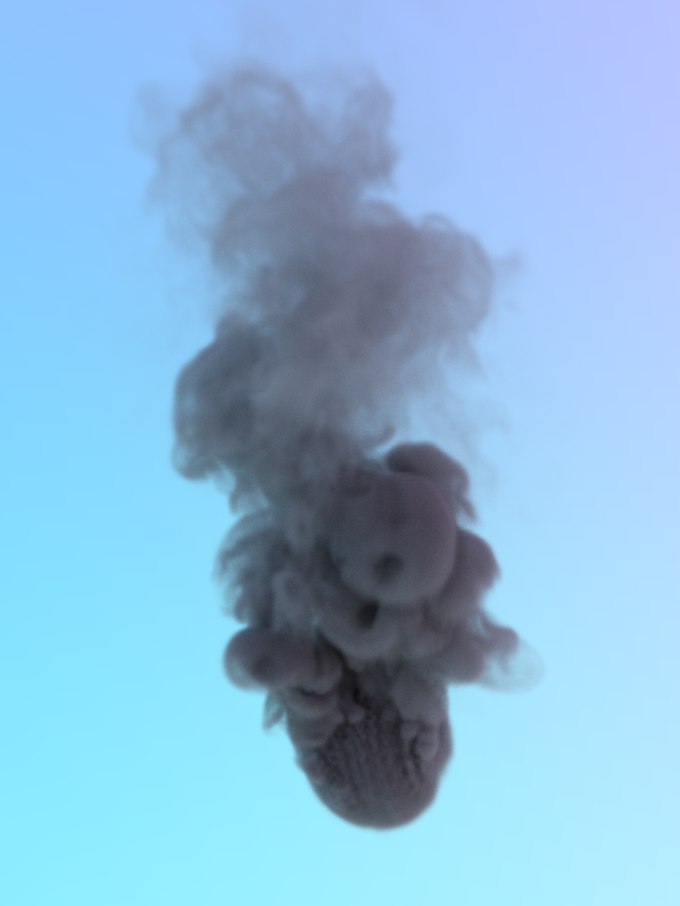
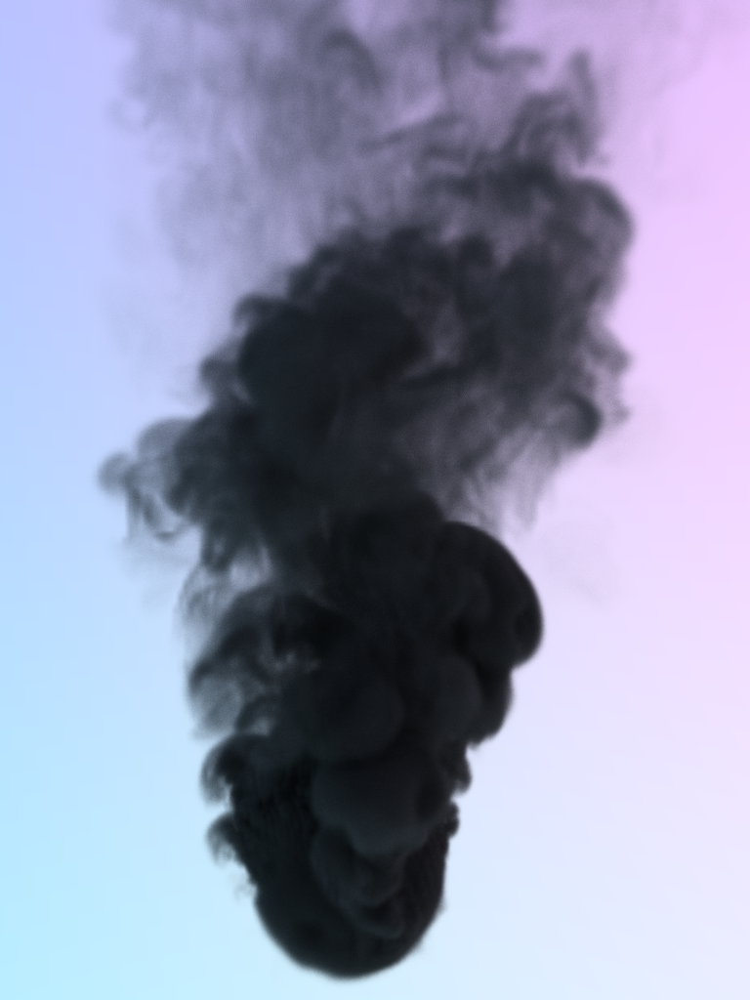

# pycuda-volumetric-renderer
A mini volumetric renderer written in Cuda-C++ and PyCuda

# Steps
1. Clone the repository recursively.
1. Make sure you installed CUDA toolkit.
1. `pip install pycuda pillow numpy configargparse matplotlib`
1. Since PyOpenvdb is not supported on Windows, I couldn't use it to import .vdb files. So, I made up a very simple file structure. _smoke_density.xyz_ is the only example in the repo.
1. See and play with _configs.txt_.
1. `python app.py`

# Functionality
* This project is aimed to be fun. There isn't even a next-event estimation in this renderer. It is a pure hobby project to see how PyCuda is working
* The only light source is a very simple procedural environment light.
* Delta tracking is used to sample free path.
* There is no wavelength dependent scattering and absorption coefficients. However, if I were to implement it, I'd use spectral tracking.

# Some outputs

